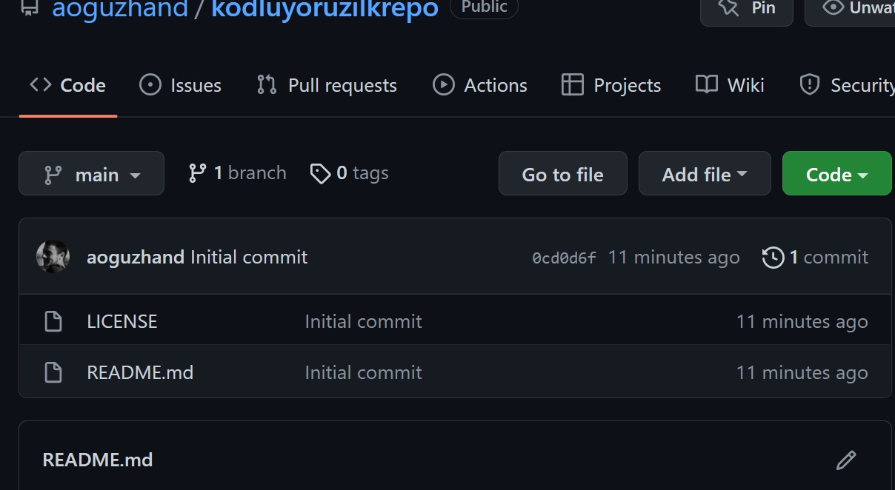

# Kodluyoruz İlk Repo

Bu repo [Kodluyoruz]() GIT eğitiminde oluşturduğumuz ilk repo. İçerisinde bir adet README dosyası, bir adet de index.html barındırıyor.



## Installation

Öncelikle projeyi klonlayın.

```bash 
git clone https://github.com/aoguzhand/kodluyoruzilkrepo.git 
```

## Usage

Projeyi klonladıktan sonra Visual Studio Code programında açın.

Linux için:

```linux
cd kodluyoruzilkrepo
code .
```

## Contributing

Pull requestler kabul edilir. Büyük değişiklikler için, lütfen neyi değiştirmek istediğinizi tartışmak için bir konu açınız.

## License

[MIT](https://choosealicense.com/licenses/mit/)

